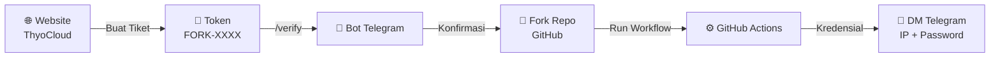

<div align="center">


**🇮🇩 Bahasa Indonesia** &nbsp;|&nbsp; [🇬🇧 English](README.en.md)

<a href="https://thyo.cloud">
  
</a>

<br/>

[](https://t.me/thyocloud)
[](https://github.com)
[](https://thyo.cloud)
[](https://t.me/thyocloud)
[](https://chat.whatsapp.com/D0p0nULTTheCRG9pHD6OGy)

**Sistem otomatisasi dengan lapisan keamanan ganda — dari verifikasi token hingga pengiriman kredensial, semua berjalan otomatis dan tersembunyi.**

</div>

---

## 🏆 Pencapaian Komunitas

<div align="center">

[](https://github.com/Thyo1/ThyoCloud-RDP/fork)
[](https://github.com/Thyo1/ThyoCloud-RDP/stargazers)
[](https://github.com/Thyo1/ThyoCloud-RDP/watchers)


| ⏱️ Durasi Sesi | 🔐 Kredensial | 🆓 Biaya |
|:---:|:---:|:---:|
| **Hingga 6 jam** | **Via DM Telegram** | **Gratis** |

### 📈 Pertumbuhan Stars

<a href="https://star-history.com/#Thyo1/ThyoCloud-RDP&Date">
  
</a>

*Terima kasih kepada seluruh pengguna yang sudah mempercayai ThyoCloud! 💙*

</div>

---

## 📋 Daftar Isi

- [Tentang Proyek](#-tentang-proyek)
- [Fitur Utama](#-fitur-utama)
- [Alur Kerja Sistem](#-alur-kerja-sistem)
- [Langkah 1 — Membuat Token](#️-langkah-1--membuat-token-rdp)
- [Langkah 2 — Verifikasi & Deploy](#-langkah-2--verifikasi--menjalankan-mesin)
- [Keamanan & Transparansi](#️-keamanan--transparansi)
- [Security Hall of Fame](#-security-hall-of-fame-special-thanks)
- [Bantuan & Komunitas](#-pusat-bantuan--komunitas)
- [Disclaimer](#️-disclaimer)

---

## 📖 Tentang Proyek

**ThyoCloud Private RDP (Fork Edition)** adalah repositori resmi untuk membuat instance **Remote Desktop Protocol (RDP)** pribadi lewat mekanisme *fork-and-run* di GitHub Actions. Setiap pengguna menjalankan workflow-nya sendiri di akun GitHub masing-masing, sehingga setiap instance bersifat **privat dan terisolasi**.

> 💡 Tidak ada log kredensial yang tampil di layar Actions. Semua data sensitif dikirim langsung ke DM Telegram Anda.

---

## ✨ Fitur Utama

<table>
<tr>
<td align="center" width="25%">

### ⚡
**Cepat**<br/>
Siap dalam ± 1–3 menit

</td>
<td align="center" width="25%">

### 🔒
**Privat**<br/>
Tiap user punya instance sendiri

</td>
<td align="center" width="25%">

### 📩
**Otomatis**<br/>
Kredensial dikirim via bot Telegram

</td>
<td align="center" width="25%">

### 🆓
**Gratis**<br/>
Tanpa biaya, sesi hingga 6 jam

</td>
</tr>
</table>

---

## 🔄 Alur Kerja Sistem



---

## 🛠️ Langkah 1 — Membuat Token RDP

| Langkah | Aksi |
|:---:|---|
| **1** | Buka **[website resmi ThyoCloud](https://thyo.cloud)** dan masuk menggunakan sesi akun Anda |
| **2** | Navigasikan ke menu **Deploy**, pilih metode **Private Fork** |
| **3** | Lengkapi formulir tujuan penggunaan server virtual dengan jelas |
| **4** | Klik **Buat Tiket Baru** untuk menghasilkan token akses (berawalan `FORK-`) |
| **5** | Salin token tersebut untuk tahap otentikasi Telegram berikutnya |

---

## 🔐 Langkah 2 — Verifikasi & Menjalankan Mesin

| Langkah | Aksi |
|:---:|---|
| **1** | Bergabung ke grup komunitas resmi: **[t.me/thyocloud](https://t.me/thyocloud)** |
| **2** | Pastikan sudah **Start** obrolan dengan `@ThyoCloudBot`, lalu ketik `/verify [TOKEN_ANDA]` di grup |
| **3** | Setelah bot mengonfirmasi akses, buka repositori ini dan klik **Fork** di kanan atas |
| **4** | Di repo hasil fork Anda, buka tab **⚡ Actions** |
| **5** | Jika muncul peringatan kuning "Workflows aren't being run on this fork", klik tombol **I understand my workflows, go ahead and enable them** |
| **6** | Di sidebar kiri, klik workflow **ThyoCloud Personal RDP (Fork)** |
| **7** | Klik dropdown **Run workflow** di sisi kanan (biasanya berwarna hijau) |
| **8** | Akan muncul form kecil berisi 2 kolom isian — isi sesuai tabel di bawah |
| **9** | Klik tombol hijau **Run workflow** untuk memulai proses |
| **10** | Refresh halaman Actions, klik run yang baru muncul untuk memantau progres secara live |

**Contoh perintah verifikasi di grup Telegram:**

```
/verify FORK-XXXXXXXXXX
```

**Detail kolom form saat klik "Run workflow":**

| Kolom | Wajib? | Isi Dengan |
|---|:---:|---|
| `Email yang terdaftar di Web ThyoCloud` | ✅ Wajib | Email yang sama persis dengan yang Anda gunakan saat membuat tiket/token di website |
| `Username RDP (Opsional - Default: thyocloud)` | ❌ Opsional | Boleh dikosongkan (otomatis pakai `thyocloud`), atau isi username custom sesuai keinginan |

> ⚠️ **Penting:** Email yang dimasukkan di form ini **harus sama** dengan email yang terdaftar saat pembuatan token di website. Jika berbeda, proses akan otomatis gagal (`⛔ GAGAL`) karena sistem tidak bisa mencocokkan verifikasi Anda.

**Setelah workflow selesai (± 1–3 menit):** Kredensial IP, Username, dan Password akan otomatis dikirim ke **DM Telegram** Anda oleh bot — bukan ditampilkan di log Actions.

---

## 🛡️ Keamanan & Transparansi

Kami mendesain layanan ini agar mudah digunakan oleh pemula, namun tetap memperhatikan aspek keamanan dan transparansi. Harap baca poin di bawah ini dengan saksama:

> [!IMPORTANT]
> **🚨 PEMBERITAHUAN TRANSPARANSI PENTING**
>
> RDP ini adalah layanan gratis berbatas waktu (maksimal 6 jam) dan dikelola secara terpusat (*managed*). Demi keperluan dukungan teknis (*troubleshooting*) jika pengguna mengalami error, sistem kami menyimpan salinan kredensial (kunci akses) **secara sementara**. Kredensial ini akan **dihapus otomatis (auto-delete)** dari database segera setelah sesi RDP Anda kedaluwarsa.

> [!CAUTION]
> **DILARANG KERAS** menggunakan layanan ini untuk aktivitas perbankan, masuk ke email utama, dompet kripto, atau menyimpan data pribadi/sensitif. Gunakan RDP ini hanya untuk keperluan *testing*, *rendering*, dan belajar.

<table>
<tr>
<td width="50%" valign="top">

### ✅ Yang Sistem Lakukan
- 🔒 Kredensial **tidak pernah** tampil di log publik Actions
- 📨 IP & Password dikirim **otomatis via DM Telegram**
- 🎫 Token bersifat **sekali pakai** & terikat 1 akun Telegram
- 🗑️ **Auto-Delete:** data sesi dihapus otomatis setelah 6 jam

</td>
<td width="50%" valign="top">

### ⚠️ Tanggung Jawab Anda
- 🚫 Jangan bagikan token RDP ke siapa pun
- 🚫 Jangan gunakan untuk data pribadi yang sensitif
- 🕒 Perhatikan batas durasi aktif server (6 jam)
- 📩 Cek DM bot setelah workflow selesai berjalan

</td>
</tr>
</table>

---

## 🏅 Security Hall of Fame (Special Thanks)

Kami sangat menghargai kontribusi para peneliti keamanan independen (*White Hat Hackers*) dan pengembang yang membantu menjaga arsitektur ThyoCloud tetap aman dan transparan bagi semua pengguna.

<div align="center">

| 🏆 Peringkat | 👤 Kontributor | 📝 Kontribusi |
|:---:|---|---|
| 🥇 | **Benjamim / junin.dev** | Audit keamanan sukarela (*responsible disclosure*) pada sistem ThyoCloud-RDP dan peningkatan transparansi arsitektur layanan |

</div>

> 🔐 Menemukan celah keamanan? Laporkan secara privat lewat [Telegram](https://t.me/thyocloud) — jangan di GitHub Issues. Detail lengkap ada di [SECURITY.md](SECURITY.md).

---

## 📞 Pusat Bantuan & Komunitas

<div align="center">

[](https://thyo.cloud)
[](https://t.me/thyocloud)
[](https://chat.whatsapp.com/D0p0nULTTheCRG9pHD6OGy)

</div>

---

## ⚠️ Disclaimer

Layanan ini disediakan **apa adanya (as-is)** untuk keperluan pribadi/edukasi. Pengguna bertanggung jawab penuh atas penggunaan resource sesuai dengan **Ketentuan Layanan (Terms of Service) GitHub** dan platform terkait lainnya.

<div align="center">

<br/>

**Made with ❤️ by ThyoCloud Team**


</div>
